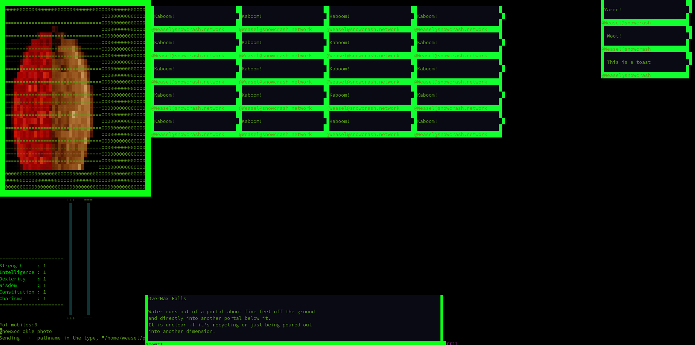
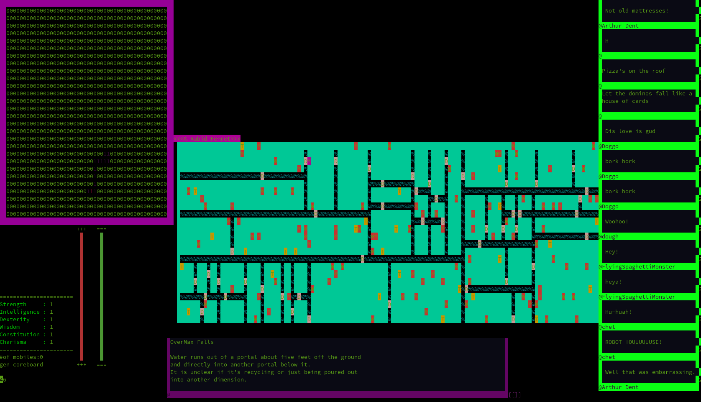
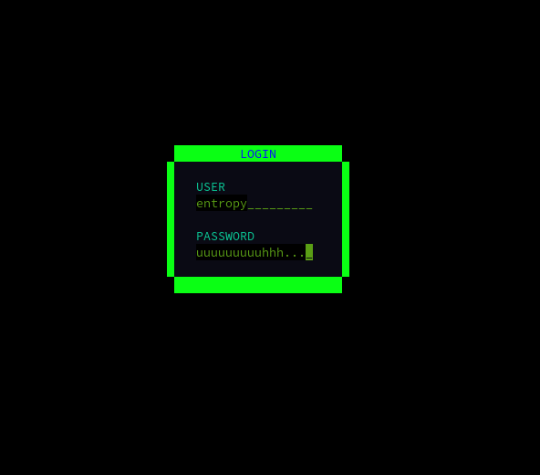
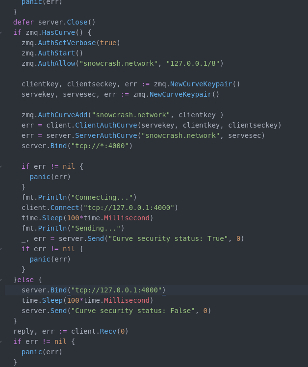
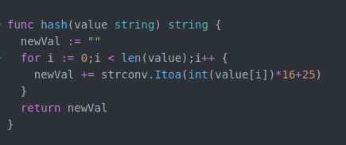

****November 8th, 2019****

I'm in the middle of adding the social aspects of the game.

Currently it will be an interface like the above, with
the left hand side holding your profile photo, as well
as your stats. Below in the empty space I will put
contents of the cels in the center top. So the short
messages will act more like a subject line if marked so.
If a "subject" cel has more content to it, it will show
up as different colour with a "...Read More" tag.

You will be able to switch through each messaage using
the arrow keys thanks to termbox-go. To start with each
message will hold a "core seed" which will allow a player
to generate a "corrupted coreboard" which is basically
a fun way of saying spawn a dungeon to be run.

Other functionality added would be the ability to either
capture a picture from your webcamera for use as a profile
picture, or using a pre-taken image and rasterizing it
to be used as a profile picture.

I think one thing I'm going to add right now is a "HELP"
option that spams all the available commands, as there
is getting to be a lot of them.

As well as generate some splash screens for the starting
coreboard set.

That's all for now!


****November 6th, 2019****

So for now I've settled on a way to handle battle.

Basically there is another "mode" rather than straight text input.

It's accessible by generating a coreboard with ```gen coreboard```
and ```lock coreboard``` ```tc:1|1``` will plop you in to space 1,1



As well as battle, I've settled on a way to start the game itself.

Once you have sncn-core on your computer, run ```sncn-core --wizinit```

then ```sncn-core --connect-core``` for the full experience, ```sncn-core --connect-core --safe-mode```
for the fallback.

It autogenerates a default persona to be used to create other characters.
Also to keep the entire engine from crapping out due to lack of playerfiles.

As for logins, today I'm implementing a hash pattern that allows for
more than one character to have a certain password. If that sounds
like the most ridiculous problem to have, you would be right. However it
is an easy fix. When I created the password hash, I only took in to
account the accounts password, which meant that if you used the same
password as someone else, you would be logged in to whomever showed
up first in the database. Which was not who it was expected to be
half the time.

But! The simple but elegant solution is to calculate the hash according
to the player's name AND password to create a unique pass/hash pair.

I thought about creating a UUID and locking it behind a password, but
I couldn't get past the fact I would have to save the password in plain
text somewhere.

So there! hash(pass) becomes hash(name+pass) and all of a sudden everyone
is unique!

The next slice of life improvement bit will be to make your login different
from your character, so one doesn't have to advertise half their
login credentials simply by logging in.

Till next time!

Entropy


****November 1st, 2019****

Today was a productive day, and I managed to create a lynchpin part of this MUD. The interface for the roguelike section of snowcrash.network


This will populate with randomized creatures and treasure, right now they show up as golden tiaras and rabid ferrets.


You can clip through walls, but that'll be an easy fix.

The battle spam design will be tomorrow, and you can bet I'm going to do something fun for that. I'm thinking a health
bar that spans the top screen, giving an imperative feel to fighting. As well for skills and attacks, things are going
to be tied to maybe half a dozen different attacks at any one time. I want to work stances in as well, to give that 
extra bit of "off" to help balance.


Also, I think I'm going to commit the heretical sin of making a MOO inside the MUD. The social aspect of this game will
rely on crafting for dungeon runs, and crafting rooms and spaces in a pve only environment.

Also I should mention, this game is going to be best played as WSAD(Q-to-win) with keypad, or straight up game pad.

Because face it, we all have at least some kind of game pad lying around. Mine is a knockoff gamecube controller.




****October 30th, 2019****
**The wonders of the year 2019**


Hah, it felt futuristic to type that.


The topic of today's blog is networking and hash functions. This MUD's first quirk is that it is not going to be running over telnet, and will require a client either made by the community or by me. The MUD itself is going to be a public facing API, linking playerfiles to database data. The user authenticates in their client, the connection from the client to the auth server is encrypted, and the password is stored in a hash table, which is a table of values that are consistently mangled by something called a hash function.


The hash function can be anything you want it to be, as long as it's consistent. For example. I'm going to take a UUID created by a chunk of code I wrote for the original social network, iterate over the characters and perform an arbitrary mathematical function on them. It will produce a string of "garbage", which we will store. The client will send a mangled key of its own, however the server will do the mangling, and associate the user with the key send at that time. As with most APIs, there will be a scope for each key, stored as a prefix on the hash function.
You might ask why bother? The answer is paranoia. If the database were ever to be compromised, the attacker dumping our precious playerfiles into their pockets, they would get a useless hashed garbage string instead of the password you happen to share with a facebook account.

So that's my reasoning.


Currently I have a working communication that utilizes zeromq for networking. zmq is one of my desert island libraries, I always manage to build something useful or fun with it with minimal hassle. 



and there we are! small asynchronous atomic communication! Encrypted by a set of keys generated at runtime even! No re-using old keys or storing them like so many acorns. However, this is the solution to a totally different problem than we were talking about. The hash function will look more like this



Now for securities sake I'm not going to be keeping this formula, but it makes sense, no? mangle the string but do it in a way that's reproducible. That's what a hash function is all about.


So there we go! I'm working on refactoring the current client into a zmq utilizing API otherwise, so that's all for tonight.
